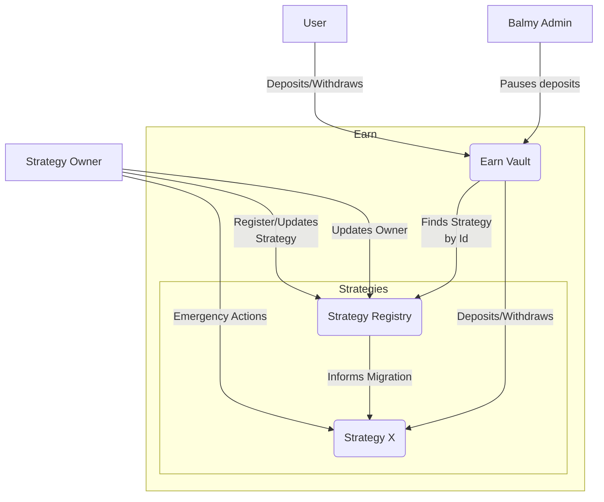

# Earn

Earn is Balmy's universal adapter for yield generating vaults. [ERC-4626](https://eips.ethereum.org/EIPS/eip-4626) does
a pretty good work of defining how yield vaults should look like, but it doesn't cover all cases. For example, some
vaults have rounds, where the user can't withdraw until the round is over. In other cases, like LSTs, withdrawals can
take a few days to be processed. And finally, there are cases where rewards are generated in tokens that are different
from the one deposited. So the idea is to try to define an universal way of generating and collecting this
yield/rewards.

In Earn, a user deposits an "asset" and immediately starts generating yield in one or more tokens (one of these tokens
could also be the same asset they deposited). When a user deposits their funds, they can choose the "strategy" they'd
like to use to generate this yield. Earn strategies are in charge of taking the asset and start generating yield, so
they will be the ones having control over all user funds. It will be up to each user to do their own due diligence and
select their preferred strategy, based on their own risk/reward inclinations.

When a user first deposit's into Earn, a "position" will be created to track their balances over time. Positions are
represented with NFTs, so they can be transferred. There is also a permission system in place that would allow owners to
grant specific permissions to other accounts. Positions can also be modified over time. For example, the owner (or
accounts with explicit permissions) could withdraw funds or deposit more assets into it.

## Definitions

### Vault

Earn's vault is the place where users deposit and withdraw their funds and rewards. Earn has a singleton vault contract,
which will be the one that keeps track of who owns what. It is also the one that implements access control and makes
sure that users can only access their own funds.

### Position

In order to use Earn, users will have to create a position. A position simply keeps track of the funds deposited and
earned by the user, in the context of a specific strategy. Once a position has been created, it can't change the chosen
strategy later.

Positions are represented with NFTs, so they can be transferred. There is also a permission system in place that would
allow owners to grant specific permissions to other accounts. Positions can also be modified over time. For example, the
owner (or accounts with explicit permissions) could withdraw funds or deposit more assets into it.

### Asset

When we talk about an asset, we refer to a token (could be ERC20 or native) that is deposited by the user to start
generating yield

### Reward Token

Like we said before, a position will deposit an asset, and generate yield in one or more tokens. We'll use the term
"reward tokens" to refer to the tokens that are generating yield, but are not the asset.

### Strategies

In Earn, a strategy will take an asset and generate yield with it. The generated yield could be in the same asset, or in
other tokens. One strategy could generate yield on multiple tokens at the same time

Each strategy will have its own logic and risks associated with it. They might use leverage or maybe have some custom
safety features, the possibilities are endless. It will be up to each user to do their own due diligence and select
their preferred strategy, based on their own risk/reward inclinations

Strategy devs, please refer to [src/interfaces/IEarnStrategy.sol](src/interfaces/IEarnStrategy.sol) to understand
important restrictions to be considered when building your own strategy

#### Strategy Registry

When a position is created, users will have to choose a strategy to generate yield with. In reality, they will be
associating their funds to a "strategy id" that itself references a strategy contract.

It could happen that the owner of the strategy wants to upgrade their strategy, so that the strategy id points to a
different contract. When that happens, they will simply have to go to the strategy registry and propose a "strategy
update". Then, after a certain delay has passed, the owner will be able to execute the update. As part of the process,
the old vault will be told by the registry that it should migrate all funds over to the new strategy.

It's important to note that even though we have this delayed upgrade mechanism in place, a strategy might simply
implement their own upgradeability process that has no delay at all. So please be careful when selecting a strategy for
your funds.

### Special Withdrawals

In some cases a user might want to perform a "special withdrawal". For example, if the strategy were to implement a lock
up period, the user might prefer to withdraw a token that represents their deposit directly and sell it on the market
for a small loss, instead of waiting for the strategy to unlock the funds.

It will be up to each strategy to support one or more of these special withdrawals

Please refer to [src/types/SpecialWithdrawals.sol](src/types/SpecialWithdrawals.sol) to understand how to execute and
interpret these withdrawals correctly

## Architecture Summary

This is a small summary of how Earn's architecture looks like. Please take into account that when we refer to "Strategy
X", we are talking about one instance of a strategy, but there are many who perform the same job



## Usage

This is a list of the most frequently needed commands.

### Build

Build the contracts:

```sh
$ forge build
```

### Clean

Delete the build artifacts and cache directories:

```sh
$ forge clean
```

### Compile

Compile the contracts:

```sh
$ forge build
```

### Coverage

Get a test coverage report:

```sh
$ forge coverage
```

### Format

Format the contracts:

```sh
$ forge fmt
```

### Gas Usage

Get a gas report:

```sh
$ forge test --gas-report
```

### Lint

Lint the contracts:

```sh
$ yarn lint
```

### Test

Run the tests:

```sh
$ forge test
```

## License

This project is licensed under MIT.
