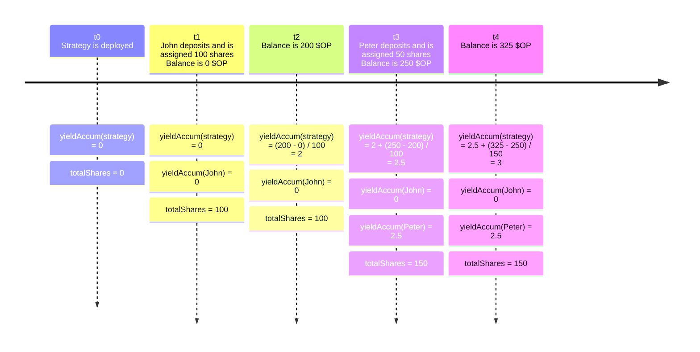
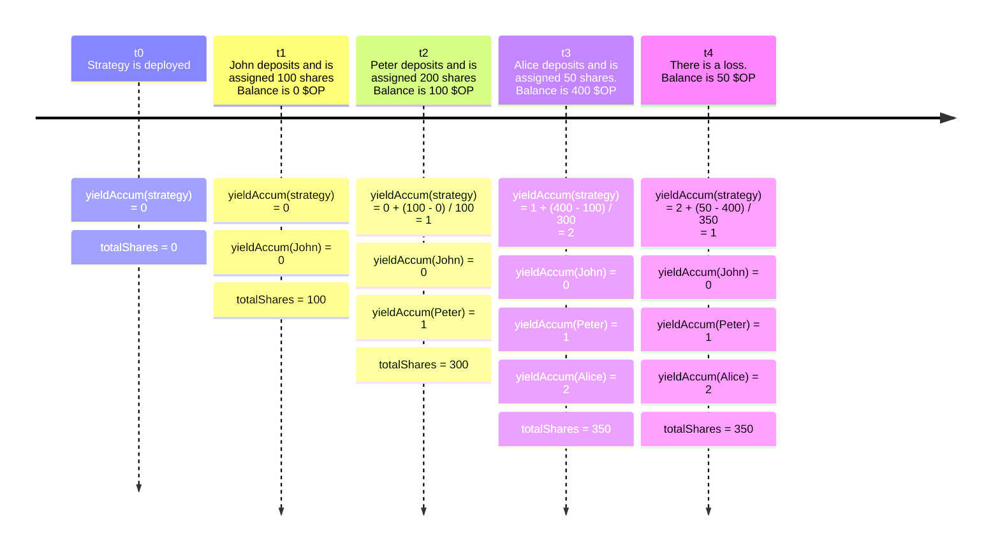
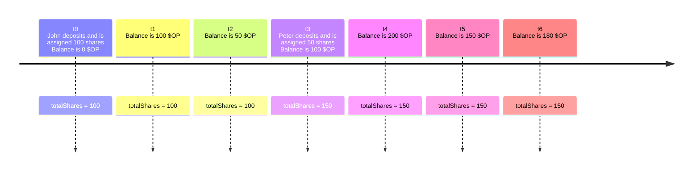
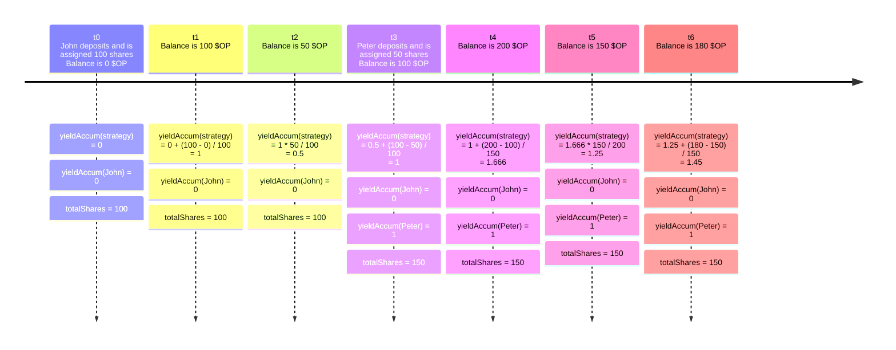
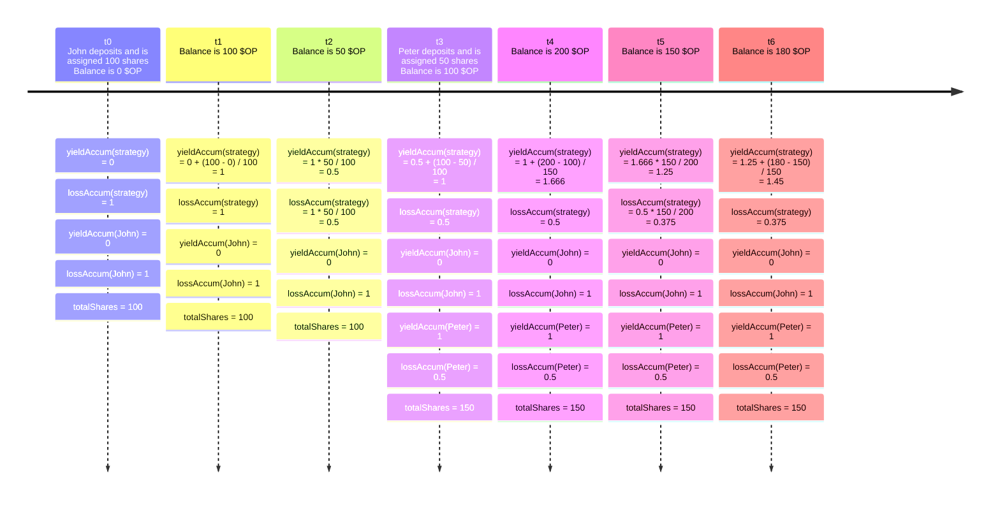

# Earn Vault

Welcome to Balmy's Earn vault! 👋

Before diving into the code, we wanted to explain a little bit what the vault does, and how it works. We recommend going
over all of [Earn's definitions](../../README.md) if you haven't already.

Earn's vault is singleton contract that holds all of Earn's positions in one place. It keeps track of who owns what, and
also makes sure that users can only access their own funds.

## How does the vault keep track of the funds that belong to each user?

When a user deposits their assets into the vault, they will be assigned a number of shares based on the deposited amount
and the total amount of assets in the strategy they chose.

For example, let's say that:

- Total amount of _$DAI_ in strategy: 10000
- Total amount of shares in strategy: 2500

And then comes John, and deposits 1000 _$DAI_ into the strategy. He will be awarded 250 shares:

$$
\begin{align}
  shares(John) & = \frac{deposit * totalShares}{totalAmount} \notag \\
  & = 1000 * 2500 / 10000 \notag \\
  & = 250 \notag \\
\end{align}
$$

Then, we can say that :

- Total amount of _$DAI_ in strategy: 11000
- Total amount of shares in strategy: 2750
- Shares assigned to John: 250

### Owned assets

Now that we know how shares are assigned during deposits, we can easily calculate how much each user owns when the total
amount of _$DAI_ increases/decreases.

$$
owned(John, DAI) = \frac{totalAmount(DAI) * shares(John)}{totalShares}
$$

So for example, if the total amount of _$DAI_ increases to 15000, then:

$$
\begin{align}
owned(John, DAI) & = \frac{totalAmount(DAI) * shares(John)}{totalShares} \notag \\
& = [15000 - 0] * 250 / 2750 \notag \\
& = 15000 * 250 / 2750 \notag \\
& \approx 1363.63 \notag \\
\end{align}
$$

Pretty good increase from the original deposit! 🤑

### Other owned tokens

Let's remember that when a user deposits assets into Earn, they'll start earning yield in one or more tokens. One of
these tokens could be the asset, but they also earn yield in other tokens.

Calculating who owns what in these others tokens is a little harder than the asset. Let's go over it with an example.
Let's say that when John last deposited into the strategy, there were 50 _$OP_ rewards already available. Then, after a
few days, there were 100 _$OP_ rewards in total. That's 50 _$OP_ rewards generated since John's deposit. So,
how much of that belongs to John?

$$
\begin{align}
owned(John, OP) & = \frac{yield(OP) * shares(John)}{totalShares} \notag \\
& = 50 * 250 / 2750 \notag \\
& \approx 4.54 \notag \\
\end{align}
$$

Now, the thing is that the total amount of shares changes over time, when a user deposits or withdraws their assets. So, with each update, we would need to calculate how much John owns by doing the same as before:

$$
\begin{align}
owned(John, OP) & = \frac{yield_{t_0 \rightarrow t_1}(OP) * shares(John)}{totalShares_{t_1}} \notag \\
& \quad+ \frac{yield_{t_1 \rightarrow t_2}(OP) * shares(John)}{totalShares_{t_2}}  \notag \\
& \quad+ \frac{yield_{t_2 \rightarrow t_3}(OP) * shares(John)}{totalShares_{t_3}}  \notag \\
& \quad+ ... \notag \\
& = shares(John) * \sum_{n=1}^{\infty} \frac{yield_{t_{n-1} \rightarrow t_n}(OP)}{totalShares_{t_n}}  \notag \\
\end{align}
$$

Now that we have this formula, we can simply keep track of this sum by using an accumulator. We'll define:

$$
yieldAccum_t = yieldAccum_{t-1} + \frac{yield_{(t-1) \rightarrow t}}{totalShares_{t}}\\
$$

Then, when a position is modified, we'll store the current accumulator value and associate it to the position. In the future, when we need to calculate how much the position has earned, we can do `yieldAccum(current) - yieldAccum(last stored for position)` to end up with the sum we needed. Let's see an example:

Now, if we calculate balances for John and Peter at this point, we'll get:

$$
\begin{align}
owned(John, OP) & = shares(John) * (yieldAccum(strategy, OP) - yieldAccum(John, OP)) \notag \\ & = 100 * (3 - 0)  \notag \\ & = 300 \notag \\
owned(Peter, OP) & = shares(Peter) * (yieldAccum(strategy, OP) - yieldAccum(Peter, OP))  \notag \\ & = 50 * (3 - 2.5)  \notag \\ & = 25 \notag \\
\end{align}
$$

_Note: there are some nuances in the actual implementation since we would need to consider that John's shares could also change over time. But the overall idea is the one we just explained_ 🤓

## Technical Choices / Limitations

### Virtual Shares

Like we said before, we are using shares to keep track of how assets should be distributed between the different
positions. While easy to implement, this approach opens the door to "inflation attacks". In order to mitigate this kind
of attack, we will be using a "virtual shares" strategy. You can read more about this attack and our defense strategy
[here](https://blog.openzeppelin.com/a-novel-defense-against-erc4626-inflation-attacks) and
[here](https://docs.openzeppelin.com/contracts/4.x/erc4626#inflation-attack).

Now, for our contract in particular, we'll be starting with a `1 asset = 1e3 shares` offset. We chose this value
because:

- We felt it was enough to reduce the impact of inflation attacks
- It would also help increase precision on low decimal tokens
- It wasn't high enough to affect precision accounting (more on this explained below)

### Precision

When working with tricky math like we explained before, it's very important that we don't lose precision. At the same
time, we'd like to use the least amount of storage possible, so that all interactions continue to be cheap to execute.

#### Position Balance

We believe that with 104 bits, we can store a strategy's balance. Assuming 18 decimals, we can store up to _2e13_ units
of tokens in it, which is enough to cover the entire circulating supply of ~95% of the top 1000 tokens in CoinMarketCap
right now (Dec 15, 2023), except for mostly meme coins. At the same time, it's enough to cover up to 5% of _$PEPE_'s
circulating supply, which is good enough for a single strategy. Let's remember that if a strategy is filled, then an
exact copy can be deployed to manage more funds.

It's important to note that tokens that use a higher amount of decimals or have much bigger supplies might not fit
correctly. **It will be up to each strategy to make sure that reported tokens can work with these limitations**.

#### Yield Accumulator

Like we explained before, we can calculate a position's balance for reward (non-asset) tokens by calculating the sum of
yielded tokens divided by the amount of total shares. Like we said before, we'll use an accumulator to keep track of
this sum, instead of calculating it every time. But we need to be careful with the precision.

The accumulator is the sum of:

$$ \frac{yield * ACCUM\ PRECISION}{total(shares)} $$

We add `ACCUM_PRECISION` so that if the yield is low, we don't lose precision. Before starting with the analysis, let's
remember that we are using a virtual assets approach, so let's assume that `1 asset ~ 1e3 shares`.

##### Worst case analysis: precision loss scenario

This would happen when we have big precision on shares, small precision on yield. For example, let's say that we are
using _$DAI_ for asset. We know that 1 _$DAI_ wei starts at _1e3_ shares. And let's say that there is 100m worth of
_$DAI_ deposited, so we have ~`1e8 * 1e18 * 1e3` shares, which is _1e29_.

Now, if we yielded 0.01 USDC, that is _1e4_. So `1e4 * ACCUM_PRECISION / 1e29` needs to be > 1, or we'll lose the yield
due to precision.

$$
\begin{align}
1e4 * ACCUM\ PRECISION / 1e29 & > 1 \notag \\
 ACCUM\ PRECISION & > 1e29 / 1e4 \notag \\
 ACCUM\ PRECISION & > 1e25 \notag  \\
\end{align}
$$

We'll go with `ACCUM_PRECISION = 1e33` so that we can support even smaller amounts of USDC but let's understand the
limitations a little more. In order to be able to track 1 wei of yield, we need to

$$
\begin{align}
1 * ACCUM\ PRECISION / total(shares) & > 1 \notag \\
total(shares) & < ACCUM\ PRECISION \notag \\
total(shares) & < 1e33 \notag \\
\end{align}
$$

Since we assume that `1 asset ~ 1e3 shares`, then we know that:

$$
\begin{align}
total(shares) & < 1e33 \notag \\
1e3 * total(assets) & < 1e33 \notag \\
total(assets) & < 1e33 / 1e3 \notag \\
total(assets) & < 1e30 \notag \\
\end{align}
$$

If the total amount of assets is over _1e30_, then we might start to lose some precision. With 18 decimals, that's
_1e12_ units of tokens we can have deposited on the strategy. To put it in easier terms, a single strategy would have to
hold more than 0.25% of _$PEPE_'s circulating supply (Dec 15, 2023) before a wei is lost due to precision 🫡

##### Worst case analysis: overflow scenario

This would happen when we have big precision on yield, small precision on shares.

Assuming we are on a blockchain that has one-second blocks, how much space do we have in the accum before it overflows?
Let's assume that we want to make sure this contract works for at least the next 10 years (because in 10 years we'll
probably be using Solana anyways, right? 😂).

There are _3.154e8_ seconds in 10 years, which means there will be _3.154e8_ blocks. Assuming a **really** worst case
scenario of one update per block, we have:

$$
\begin{align}
maxSize(update) & < \frac{totalSpace}{maxAmount(updates)} \notag \\
& < \frac{2^{151}}{3.154e8} \notag \\
& < 9.05e36 \notag \\
\end{align}
$$

So, we know that:

$$
\begin{align}
\frac{yield * ACCUM\ PRECISION}{total(shares)} & < maxSize(update) \notag \\
\frac{yield * 1e33}{total(shares)} & < 9.05e36 \notag \\
\frac{yield}{total(shares)} & < 9050  \notag \\
\end{align}
$$

Let's assume that the asset is a low decimals token like USDC, and there are 10 USDC deposited. `1 asset ~ 1e3 shares`.
So we have `10 * 1e6 * 1e3` shares, which is _1e10_.

$$
\begin{align}
yield / total(shares) & < 9050  \notag \\
yield / 1e10 & < 9050  \notag \\
yield & < 9050 * 1e10  \notag \\
yield & < 9.05e13  \notag \\
\end{align}
$$

This means that if 10 USDC worth of tokens generate less than _9.05e13_ worth of tokens **per second**, then we have at
least 10 years before the accum overflows.

To put it in _$OP_ terms (known for its use as a reward), that would be 0,0002 (Dec 15, 2023) usd per second, which
would be $17 usd per day. Not bad for a 10 _$USDC\_ deposit 😂

Again, tokens with more decimals or higher supplies might be closer to an overflow than the examples we just layed out,
but **it will be up to each strategy to make sure that the tokens they support work correctly with these limitations**.

### Yield Losses

First, a note on losses. Today in DeFi, reward tokens are mostly received as a reward for providing liquidity, as a
form of "liquidity mining". These rewards tend to be distributed based on the amount of deposited liquidity, so the amount of
earned rewards tends to increase over time until all the rewards are assigned. As a general rule, these rewards don't
tend to diminish over time, only increase. There could be a few scenarios where a loss happens, like hacks or if a
protocol removes all rewards that were unclaimed after a long period of time. But we believe that generally, there
shouldn't be any losses in reward tokens.

So far, we've described how we can calculate how much each position has earned for reward tokens. The approach is
simple, but it has its limitations. For example, it does not handle correctly a scenario where there might be a loss
between two updates. Let's see an example:

So how much is assigned to each user?

$$
\begin{align}
owned(John, OP) & = shares(John) * (yieldAccum(strategy, OP) - yieldAccum(John, OP)) \notag \\ & = 100 * (1 - 0)  \notag \\ & = 100 \notag \\
owned(Peter, OP) & = shares(Peter) * (yieldAccum(strategy, OP) - yieldAccum(Peter, OP))  \notag \\ & = 200 * (1 - 1)  \notag \\ & = 0 \notag \\
owned(Alice, OP) & = shares(Alice) * (yieldAccum(strategy, OP) - yieldAccum(Alice, OP))  \notag \\ & = 50 * (1 - 2)  \notag \\ & = -50 \notag \\
\end{align}
$$

We can see that it doesn't add up 😅 The problem is that earnings can be distributed to everyone based on shares, but
losses need to be distributed according to what each user had earned up to the moment the loss occurred.

So what would we want the balances to look like? Ideally, we would distribute the losses based on what each user had earned up to that point, and then continue to distribute yield as usual. Something like this:

$$ balance(user) = earnedBeforeLoss(user) \ast \frac{strategyBalance_{when \ loss \ happened}}{strategyBalance_{last\ snapshot \ before \ loss}} + earnedSinceLoss(user) $$

Let's see how this would work in practice:

$$
\begin{align}
owned(John, OP, t_1) & = owned(John, OP, t_0) + shares(John) * yield_{t_0 \rightarrow t_1} / totalShares_{t_1} \notag \\ 
                     & = 0 + 100 * 100 / 100 \notag \\ 
                     & = 100 \notag \\
owned(John, OP, t_2) & = owned(John, OP, t_1) * balance_{t_2} / balance_{t_1} \notag \\
                     & = 100 * 50 / 100 \notag \\
                     & = 50 \notag \\
owned(John, OP, t_3) & = owned(John, OP, t_2) + shares(John) * yield_{t_2 \rightarrow t_3} / totalShares_{t_3} \notag \\ 
                     & = 50 + 100 * 50 / 100 \notag \\
                     & = 100 \notag \\
owned(John, OP, t_4) & = owned(John, OP, t_3) + shares(John) * yield_{t_3 \rightarrow t_4} / totalShares_{t_4} \notag \\ 
                     & = 100 + 100 * 100 / 150 \notag \\
                     & = 166.67 \notag \\                
owned(John, OP, t_5) & = owned(John, OP, t_4) * balance_{t_5} / balance_{t_4} \notag \\
                     & = 166.67 * 150 / 200 \notag \\
                     & = 125 \notag \\
owned(John, OP, t_6) & = owned(John, OP, t_5) + shares(John) * yield_{t_5 \rightarrow t_6} / totalShares_{t_6} \notag \\ 
                     & = 125 + 100 * 30 / 150 \notag \\
                     & = 145 \notag \\                    
owned(Peter, OP, t_4) & = owned(Peter, OP, t_3) + shares(Peter) * yield_{t_3 \rightarrow t_4} / totalShares_{t_4} \notag \\ 
                     & = 0 + 50 * 100 / 150 \notag \\
                     & = 33.33 \notag \\
owned(Peter, OP, t_5) & = owned(Peter, OP, t_4) * balance_{t_5} / balance_{t_4} \notag \\ 
                     & = 33.33 * 150 / 200 \notag \\
                     & = 25 \notag \\   
owned(Peter, OP, t_6) & = owned(Peter, OP, t_5) + shares(Peter) * yield_{t_5 \rightarrow t_6} / totalShares_{t_6} \notag \\ 
                     & = 25 + 50 * 30 / 150 \notag \\
                     & = 35 \notag \\                                        
\end{align}
$$

Now, we can see that the previous definitions of `yieldAccum` doesn't work anymore. So we'll make the following changes:

$$ 
\begin{align}
yieldAccum_t = \begin{dcases}
    0,&  \text{if } t = 0\\
    yieldAccum_{t-1} + \frac{balance_{t} - balance_{t-1}}{totalShares_{t}},& \text{if } balance_{t} \geq balance_{t-1}\\
    yieldAccum_{t-1} * \frac{balance_{t}}{balance_{t-1}},                    & \text{otherwise}    
\end{dcases} \notag \\
\end{align}
$$

Now, let's check the previous example again:

We can see that we can now calculate the balance for John correctly at each point in time, but the math doesn't add up for Peter. This is because there is a part missing: we reduce the strategy's yield accumulator when there are losses, but we don't do the same for yield accumulator associated to the user/position. As a side note, it only worked for John because the yield accumulator was 0 when he deposited. But we can fix this issue by using a new accumulator to keep track of all losses:

$$
\begin{align}
lossAccum_t = \begin{dcases}
    1,&  \text{if } t = 0\\
    lossAccum_{t-1},& \text{if } balance_{t} \geq balance_{t-1}\\
    lossAccum_{t-1} * \frac{balance_{t}}{balance_{t-1}},                    & \text{otherwise}    
\end{dcases}  \notag \\
\end{align}
$$

Let's go back to the previous example one more time and see we can keep track of it:

Now that we have all the pieces, let's see how it works in practice:

$$
\begin{align}
owned(user, OP) & = shares(user) * (yieldAccum(strategy, OP) - yieldAccum(user, OP) * \frac{lossAccum(strategy, OP)}{lossAccum(user, OP)}) \notag \\
\end{align}
$$

And now we can calculate both John and Peter's balances correctly 🎉

#### Loss accumulator precision

Since the loss accumulator is successively multiplied, to avoid under/overflow, we had two alternatives: start it at its
maximum value and then decrease it or take the inverse approach. We chose for the first option as it handles rounding
better.

#### Storing Complete Losses

We just described how to take losses into account when calculate a position's balance for reward tokens. However, when a
complete loss occurs (balance goes to zero), the loss accumulator multiplies down to zero and stays there, which won't work for our purposes.
Our solution requires storing a counter to track when there was a complete loss, so that each position can compare their own counter against the strategy's counter. Then, after the complete loss has been accounted for, we can calculate the position's balance normally. Technically speaking, when a complete loss happens, both yield and loss accumulators are reset to their initial values (0 and 1 respectively). We do this because a complete loss can be considered as if the strategy had just started from scratch.

On a technical note, the vault is prepared to support **up to 255** complete loss events per token, for each strategy. This should be enough
to cover for unexpected circumstances such as hacks, but it's very important that the strategy avoids complete losses as
much as possible.

After the 255 complete losses limit has been reached, the vault will simply set all position balances to zero. It will
then be up to each strategy to distribute any left funds in a way they deem fit.
